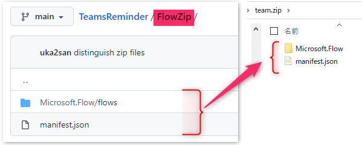

# TeamsReminder
implement reminder in teams by Power Automate

# 作成理由
Teams に Reminder がなかったので。

# how to use
1. Download "ZipFiles" and zip them 
1. インポート at [Power Automate](https://japan.flow.microsoft.com/)
1. Remind したいメッセージから、起動 
1. Remind 時期などを設定して、開始 

# 制限
- 30日以内でしか動けない為、カレンダーでの指定が30日以内でないとエラーへ・・
